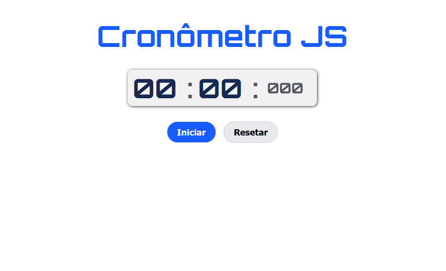
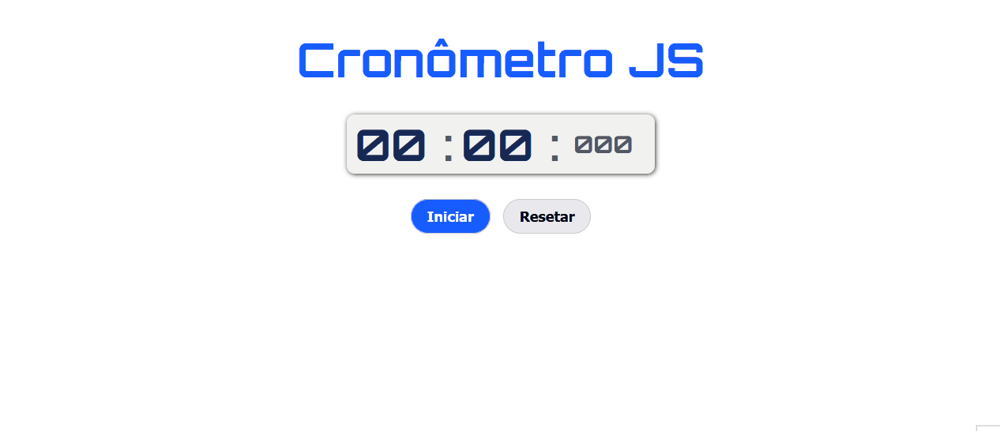

# Cronômetro com Javascript

 

## Sumário

- [Visão geral](#visão-geral)
  - [O Desafio](#o-desafio)
  - [Screenshot](#screenshot)
- [Links](#links)
- [Meu processo](#meu-processo)
  - [Tecnologias](#tecnologias-usadas)
  - [O que eu aprendi](#o-que-aprendi)
  - [Dificuldades](#dificuldades)
- [Contato](#contato)

## Visão Geral

### O Desafio

Os usuários devem ser capazes de:

- Interagir com o layout ideal para o aplicativo, dependendo do tamanho da tela do dispositivo;
- Interagir com os estados de foco para todos os elementos interativos na página;
- Conseguir Iniciar, Pausar, Continuar e Resetar a contagem do cronômetro;

### Screenshot

## Links

- Repositório: https://github.com/mazziera/cronometro-js
- Deploy: 

## Meu Processo

### Tecnologias usadas:

- HTML5 Semantico
- CSS3 responsivo
- Flexbox
- Javascript DOM
- Funções Javascript

### O que aprendi?

Pude consolidar ainda mais meus conhecimentos em HTML semântico, o poder das grouping tags de facilitarem a estruturação do projeto, links posicionados de forma semântica;  
Também o CSS responsivo com Media Queries para gerar uma melhor experiência para o usuário, independendo do dispositivo. Flexbox, elementos posicionados de forma rápida e prática. Modelo de Caixas. Tipografia. Variaveis. Displays ;  
Pude também firmar mais meu conhecimento em manipulação do DOM do Javascript e a sintaxe de modo geral desta incrível linguagem.  
Atributo defer foi uma novidade, onde este permite conectar os scripts javascript e carregá-los após o html ser renderizado.  
Utilizar diversos eventos e funções fez eu aprimorar minha lógica de programação e a organização das estruturas do código de um modo geral.

### Dificuldades

Tive dificuldade com a lógica de programção, entender como cada etapa das funcionalidades do cronômetro seriam transpostas para o javascript.

## Contato

- Github - [mazziera.io](https://github.com/mazziera)
- Frontend Mentor - [@mazziera](https://www.frontendmentor.io/profile/mazziera)
- Linkedin - [@raphael-mazzieri](https://www.linkedin.com/in/raphael-mazzieri/)